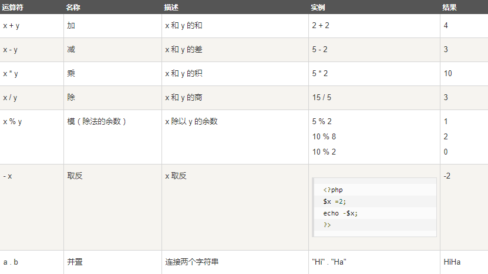
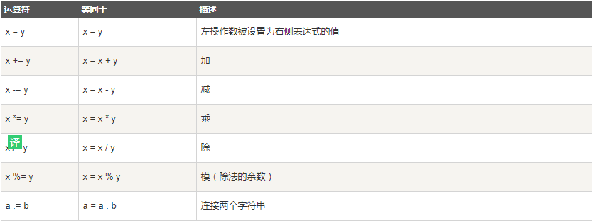
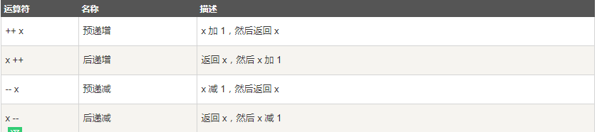
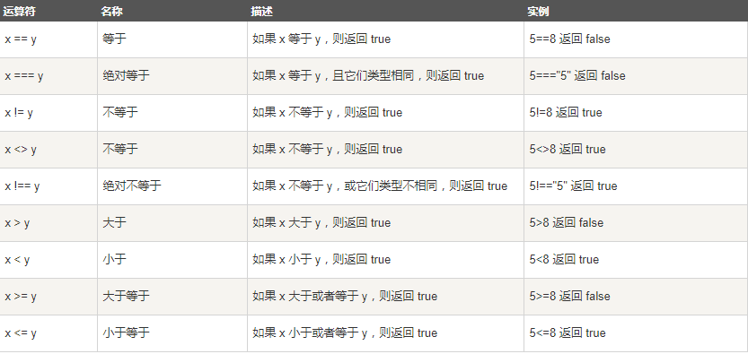
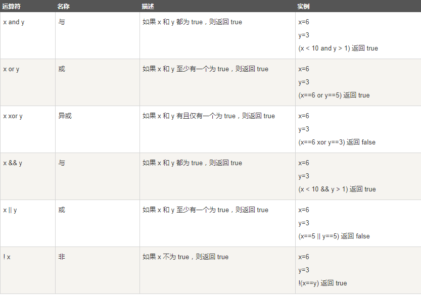
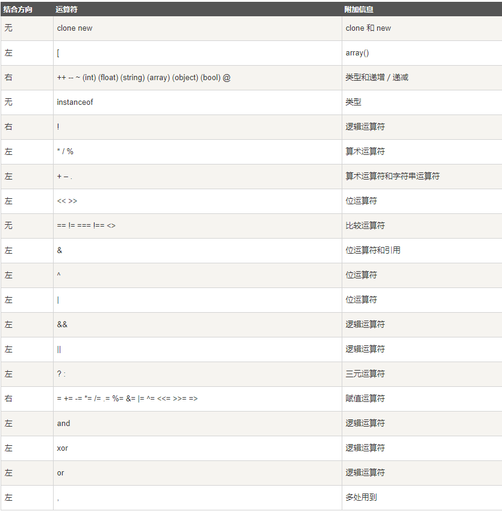

****
## 学习内容

### 什么是运算符？
### 运算符演示


#### 什么是运算符？


##### PHP 算术运算符



```

<?php 
$x = 1; 
$y = 2;
echo ($x + $y); // 输出3
echo '<br>';  // 换行
 
echo ($x - $y); // 输出-1
echo '<br>';  // 换行
 
echo ($x * $y); // 输出2
echo '<br>';  // 换行
 
echo ($x / $y); // 输出0.5
echo '<br>';  // 换行
 
echo ($x % $y); // 输出1

echo '<br>';  // 换行
 
echo -$x; // -1

?>


```

> PHP7+ 版本新增整除运算符 intdiv(),使用实例：
```
<?php
var_dump(intdiv(13, 3)); // int(1)
?>
```

##### 赋值运算符


```  
<?php 
$x = 22; 
echo $x; // 输出22
 
$y = 21; 
$y += 100;
echo $y; // 输出121
 
$z = 53;
$z -= 20;
echo $z; // 输出23
 
$i = 5;
$i *= 6;
echo $i; // 输出30
 
$j = 15;
$j /= 5;
echo $j; // 输出3
 
$k = 15;
$k %= 4;
echo $k; // 输出3

$a = "Hello";
$b = $a . " world!";
echo $b; // 输出Hello world! 
 
$x="Hello";

$x .= " world!";

echo $x; // 输出Hello world! 
?>


```

##### PHP 自增/自减运算符


```  
<?php

$x=10;
 
echo ++$x; // 输出11
 
$y = 10; 
echo $y++; // 输出10
echo $y++; // 输出11 
$z = 5;
echo --$z; // 输出4
 
$i = 5;
echo $i--; // 输出5
echo $i;   // 输出4
?>

```


##### PHP 比较运算符



``` 
<?php
$x = 100; 
$y = "100";
 
var_dump($x == $y);
echo "<br>";
var_dump($x === $y);
echo "<br>";
var_dump($x != $y);
echo "<br>";
var_dump($x !== $y);
echo "<br>";
 
$a = 50;
$b = 90;
 
var_dump($a > $b);
echo "<br>";
var_dump($a < $b);
?>

```

##### PHP 逻辑运算符



> 运算符优先级中，or 和 ||，&& 和 and 都是逻辑运算符，效果一样，但是其优先级却不一样。

``` 
<?php
// 优先级： &&  >  =  >  and
// 优先级： ||  >  =  >  or
 
$a = 3;
$b = false;
$c = $a or $b;
var_dump($c);          // 这里的 $c 为 int 值3，而不是 boolean 值 true
$d = $a || $b;
var_dump($d);          //这里的 $d 就是 boolean 值 true 
?>

```

>括号的使用:我们通过括号的配对来明确标明运算顺序，而非靠运算符优先级和结合性来决定，通常能够增加代码的可读性。

##### 三元运算符

格式：(expr1) ? (expr2) : (expr3) 

``` 
$age = 20;
$text = ($age > 18) ? "成年" : "未成年";
echo $text; 
```
##### 运算符优先级




### 课后作业

请写出输出的内容

题目1：
```  
$x = 2;
echo $x == 2 ? '我' : $x == 1 ? '你' : '它'; 

```

题目2：

``` 
$a = 3;
$b = 5;
if ($a = 3 || $b = 7)  {
    $a++;
    $b++;
}
echo '$a= ', $a, '$b=', $b;
```

题目3：

```

$a = 3;
$b = 4;
if ($a = 5 && ($b = 6)) {
    $a += 1;
    $b += 1;
}
echo '$a= ', $a, '$b=', $b;

```

题目4：

``` 
$a = null;
$b = true;
$a++;
$b++;
echo '$a= ', $a, '$b=', $b;

```

